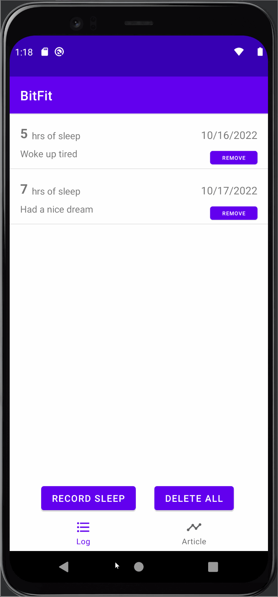

# Android Project 6 - *Bitfit Part 2*

Submitted by: **David Obi**

**Bitfit** is a health metrics app that allows users to track sleep. 

Time spent: **2.5** hours spent in total

## Required Features

The following **required** functionality is completed:

- [X] **Use at least 2 Fragments**
- [X] **Create a new dashboard fragment where users can see a summary of their entered data**
- [X] **Use one of the Navigation UI Views (BottomNavigation, Drawer Layout, Top Bar) to move between the fragments**

The following **optional** features are implemented:

- [ ] **Add a more advanced UI (e.g: Graphing) for tracking trends in metrics**
- [ ] **Implement daily notifications to prompt users to fill in their data**

The following **additional** features are implemented:

- [X] Delete all button to delete all entries to data set

## Video Walkthrough

Here's a walkthrough of implemented user stories:

<!-- Replace this with whatever GIF tool you used! -->
GIF created with [LiceCap](http://www.cockos.com/licecap/).  
<!-- Recommended tools:
[Kap](https://getkap.co/) for macOS
[ScreenToGif](https://www.screentogif.com/) for Windows
[peek](https://github.com/phw/peek) for Linux. -->

## Notes

I was not sure of the most efficient way to pass the data of the last inserted sleep log to the fragment for the dashboard.
Additionally, the "Delete All" button crashes my program when switching to the dashboard which I believe is because they are using the same thread.

## License

    Copyright [2024] [David Obi]

    Licensed under the Apache License, Version 2.0 (the "License");
    you may not use this file except in compliance with the License.
    You may obtain a copy of the License at

        http://www.apache.org/licenses/LICENSE-2.0

    Unless required by applicable law or agreed to in writing, software
    distributed under the License is distributed on an "AS IS" BASIS,
    WITHOUT WARRANTIES OR CONDITIONS OF ANY KIND, either express or implied.
    See the License for the specific language governing permissions and
    limitations under the License.
